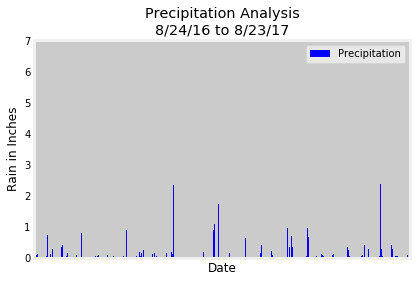
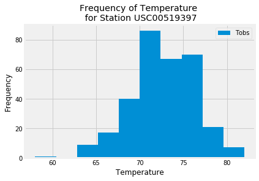
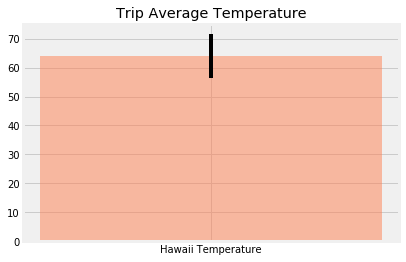
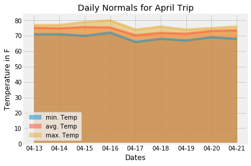

```python
%matplotlib inline
from matplotlib import style
style.use('fivethirtyeight')
import matplotlib.pyplot as plt
import matplotlib.dates as mdates
```


```python
import numpy as np
import pandas as pd
pd.set_option('display.max_rows', 10000)
```


```python
import datetime as dt
```

# Reflect Tables into SQLAlchemy ORM


```python
# Python SQL toolkit and Object Relational Mapper
import sqlalchemy
from sqlalchemy.ext.automap import automap_base
from sqlalchemy.orm import Session
from sqlalchemy import create_engine, func, inspect, and_
from sqlalchemy import (
    Column,
    Integer,
    String,
    Boolean,
    ForeignKey,
    DateTime,
    Sequence,
    Float
)
```


```python
engine = create_engine("sqlite:///Resources/hawaii.sqlite")
inspector = inspect(engine)
```


```python
# reflect an existing database into a new model
Base = automap_base()
# reflect the tables
Base.prepare(engine, reflect=True)
```


```python
# We can view all of the classes that automap found
Base.classes.keys()
```
    ['measurement', 'station']

```python
# Save references to each table
Measurement = Base.classes.measurement
Station = Base.classes.station
```


```python
# Create our session (link) from Python to the DB
session = Session(engine)
```


```python
columns = inspector.get_columns('Measurement')
for c in columns:
   print(c['name'], c["type"])
columns
```
    id INTEGER
    station TEXT
    date TEXT
    prcp FLOAT
    tobs FLOAT
    
    [{'name': 'id',
      'type': INTEGER(),
      'nullable': False,
      'default': None,
      'autoincrement': 'auto',
      'primary_key': 1},
     {'name': 'station',
      'type': TEXT(),
      'nullable': True,
      'default': None,
      'autoincrement': 'auto',
      'primary_key': 0},
     {'name': 'date',
      'type': TEXT(),
      'nullable': True,
      'default': None,
      'autoincrement': 'auto',
      'primary_key': 0},
     {'name': 'prcp',
      'type': FLOAT(),
      'nullable': True,
      'default': None,
      'autoincrement': 'auto',
      'primary_key': 0},
     {'name': 'tobs',
      'type': FLOAT(),
      'nullable': True,
      'default': None,
      'autoincrement': 'auto',
      'primary_key': 0}]


# Exploratory Climate Analysis


```python
# Design a query to retrieve the last 12 months of precipitation data and plot the results
datequery = session.query(Measurement.id, Measurement.date, Measurement.prcp).filter(Measurement.date.between('2016-08-23', '2017-08-23')).order_by(Measurement.date).all()
# datequery
# Calculate the date 1 year ago from the last data point in the database

# Perform a query to retrieve the data and precipitation scores

# Save the query results as a Pandas DataFrame and set the index to the date column
prcp_df = pd.DataFrame(datequery)
prcp_df.drop(["id"], axis=1)
#prcp_df.set_index('date', inplace = True)
#prcp_df.head()
#Sort the dataframe by date

# Use Pandas Plotting with Matplotlib to plot the data
prcp_df.plot.bar('date', 'prcp', color="blue")
plt.xlabel("Date")
plt.tick_params(
    axis='x',  
    which='both',
    bottom=True,   
    top=False,     
    labelbottom=False)
plt.ylabel("Rain in Inches")
plt.title("Precipitation Analysis\n8/24/16 to 8/23/17")
plt.legend(["Precipitation"])
plt.savefig('Images/Precipitation Analysis')
plt.show()
```




```python
# Use Pandas to calcualte the summary statistics for the precipitation data

prcp_df.describe()
```


<div>
<table border="1" class="dataframe">
  <thead>
    <tr style="text-align: right;">
      <th></th>
      <th>id</th>
      <th>prcp</th>
    </tr>
  </thead>
  <tbody>
    <tr>
      <th>count</th>
      <td>2230.000000</td>
      <td>2021.000000</td>
    </tr>
    <tr>
      <th>mean</th>
      <td>10158.570404</td>
      <td>0.177279</td>
    </tr>
    <tr>
      <th>std</th>
      <td>5603.500203</td>
      <td>0.461190</td>
    </tr>
    <tr>
      <th>min</th>
      <td>2364.000000</td>
      <td>0.000000</td>
    </tr>
    <tr>
      <th>25%</th>
      <td>5287.250000</td>
      <td>0.000000</td>
    </tr>
    <tr>
      <th>50%</th>
      <td>8930.500000</td>
      <td>0.020000</td>
    </tr>
    <tr>
      <th>75%</th>
      <td>14750.750000</td>
      <td>0.130000</td>
    </tr>
    <tr>
      <th>max</th>
      <td>19550.000000</td>
      <td>6.700000</td>
    </tr>
  </tbody>
</table>
</div>


```python
# Design a query to show how many stations are available in this dataset?
stationquery = session.query(Station.station, Station.station).count()
print(f"Total number of Stations: {stationquery}")
```

    Total number of Stations: 9


```python
# What are the most active stations? (i.e. what stations have the most rows)?
# List the stations and the counts in descending order.
activestations = session.query(Measurement.station, func.count(Measurement.tobs)).group_by(Measurement.station).order_by(func.count(Measurement.tobs).desc())
#activestations.all()
data = list(activestations)
activestations_df = pd.DataFrame(data, columns=['Station', 'Count'])
activestations_df

```


<div>
<table border="1" class="dataframe">
  <thead>
    <tr style="text-align: right;">
      <th></th>
      <th>Station</th>
      <th>Count</th>
    </tr>
  </thead>
  <tbody>
    <tr>
      <th>0</th>
      <td>USC00519281</td>
      <td>2772</td>
    </tr>
    <tr>
      <th>1</th>
      <td>USC00519397</td>
      <td>2724</td>
    </tr>
    <tr>
      <th>2</th>
      <td>USC00513117</td>
      <td>2709</td>
    </tr>
    <tr>
      <th>3</th>
      <td>USC00519523</td>
      <td>2669</td>
    </tr>
    <tr>
      <th>4</th>
      <td>USC00516128</td>
      <td>2612</td>
    </tr>
    <tr>
      <th>5</th>
      <td>USC00514830</td>
      <td>2202</td>
    </tr>
    <tr>
      <th>6</th>
      <td>USC00511918</td>
      <td>1979</td>
    </tr>
    <tr>
      <th>7</th>
      <td>USC00517948</td>
      <td>1372</td>
    </tr>
    <tr>
      <th>8</th>
      <td>USC00518838</td>
      <td>511</td>
    </tr>
  </tbody>
</table>
</div>


```python
# Using the station id from the previous query, calculate the lowest temperature recorded, 
# highest temperature recorded, and average temperature of the most active station?
#[(54.0, 85.0, 71.66378066378067)]
lowesttemp = session.query(func.min(Measurement.tobs)).group_by(Measurement.station).order_by(func.count(Measurement.tobs).desc()).first()
listlt = list(lowesttemp)
print(f"The lowest recorded temperature: {listlt}")
```

    The lowest recorded temperature: [54.0]


```python
highesttemp = session.query(func.max(Measurement.tobs)).group_by(Measurement.station).order_by(func.count(Measurement.tobs).desc()).first()
listht = list(highesttemp)
print(f"The highest recorded temperature: {listht}")
```

    The highest recorded temperature: [85.0]


```python
avgtemp = session.query(func.avg(Measurement.tobs)).group_by(Measurement.station).order_by(func.count(Measurement.tobs).desc()).first()
listavg = list(avgtemp)
print(f"The average recorded temperature: {listavg}")
```

    The average recorded temperature: [71.66378066378067]


```python
# Choose the station with the highest number of temperature observations.
highHIGHtemp = session.query(Measurement.station, func.max(Measurement.tobs)).filter(Measurement.prcp > 0).first()
highHIGHtemp

```

    ('USC00519397', 87.0)

```python
# Query the last 12 months of temperature observation data for this station and plot the results as a histogram
year_tempobv = session.query(Measurement.date, Measurement.tobs).filter(Measurement.prcp > 0).filter(Measurement.date.between('2016-08-23', '2017-08-23')).all()
year_tempobv_dict = dict(year_tempobv)
year_tempobv_dates = list(year_tempobv_dict.keys())
year_tempobv_temp = list(year_tempobv_dict.values())
year_tempobv

```

    [('2016-08-24', 79.0),
     ('2016-08-25', 80.0),
     ('2016-08-28', 78.0),
     ('2016-08-31', 80.0),
     ('2016-09-04', 75.0),
     ('2016-09-07', 76.0),
     ('2016-09-09', 79.0),
     ('2016-09-11', 76.0),
     ('2016-09-13', 78.0),
     ('2016-09-14', 75.0),
     ('2016-09-15', 79.0),
     ('2016-09-16', 80.0),
     ('2016-09-17', 79.0),
     ('2016-09-22', 76.0),
     ('2016-09-26', 80.0),
     ('2016-09-27', 80.0),
     ('2016-10-17', 78.0),
     ('2016-10-21', 77.0),
     ('2016-10-22', 79.0),
     ('2016-10-23', 78.0),
     ('2016-10-25', 77.0),
     ('2016-10-30', 76.0),
     ('2016-10-31', 77.0),
     ('2016-11-08', 71.0),
     ('2016-11-19', 75.0),
     ('2016-11-20', 76.0),
     ('2016-11-21', 76.0),
     ('2016-11-22', 75.0),
     ('2016-11-23', 72.0),
     ('2016-11-24', 74.0),
     ('2016-11-25', 75.0),
     ('2016-11-26', 73.0),
     ('2016-11-28', 75.0),
     ('2016-11-30', 75.0),
     ('2016-12-01', 75.0),
     ('2016-12-02', 72.0),
     ('2016-12-04', 71.0),
     ('2016-12-05', 68.0),
     ('2016-12-06', 67.0),
     ('2016-12-08', 73.0),
     ('2016-12-09', 70.0),
     ('2016-12-10', 70.0),
     ('2016-12-11', 70.0),
     ('2016-12-12', 66.0),
     ('2016-12-13', 67.0),
     ('2016-12-14', 70.0),
     ('2016-12-17', 71.0),
     ('2016-12-18', 73.0),
     ('2016-12-19', 69.0),
     ('2016-12-22', 71.0),
     ('2016-12-23', 72.0),
     ('2016-12-24', 74.0),
     ('2016-12-26', 74.0),
     ('2016-12-28', 71.0),
     ('2016-12-29', 73.0),
     ('2016-12-30', 69.0),
     ('2016-12-31', 66.0),
     ('2017-01-22', 72.0),
     ('2017-01-24', 69.0),
     ('2017-01-25', 72.0),
     ('2017-01-29', 67.0),
     ('2017-02-07', 64.0),
     ('2017-02-11', 69.0),
     ('2017-02-12', 68.0),
     ('2017-02-13', 74.0),
     ('2017-02-16', 71.0),
     ('2017-02-21', 70.0),
     ('2017-02-22', 72.0),
     ('2017-02-23', 74.0),
     ('2017-02-25', 64.0),
     ('2017-03-01', 66.0),
     ('2017-03-02', 73.0),
     ('2017-03-03', 69.0),
     ('2017-03-05', 71.0),
     ('2017-03-24', 73.0),
     ('2017-04-14', 75.0),
     ('2017-04-15', 73.0),
     ('2017-04-17', 74.0),
     ('2017-04-19', 74.0),
     ('2017-04-20', 78.0),
     ('2017-04-21', 73.0),
     ('2017-04-22', 76.0),
     ('2017-04-23', 77.0),
     ('2017-04-29', 72.0),
     ('2017-04-30', 63.0),
     ('2017-05-01', 75.0),
     ('2017-05-11', 78.0),
     ('2017-05-15', 78.0),
     ('2017-05-16', 78.0),
     ('2017-05-18', 73.0),
     ('2017-05-23', 87.0),
     ('2017-05-24', 77.0),
     ('2017-05-25', 77.0),
     ('2017-05-27', 74.0),
     ('2017-05-28', 76.0),
     ('2017-05-30', 76.0),
     ('2017-05-31', 79.0),
     ('2017-06-03', 79.0),
     ('2017-06-10', 77.0),
     ('2017-06-11', 79.0),
     ('2017-06-12', 83.0),
     ('2017-06-18', 77.0),
     ('2017-06-20', 78.0),
     ('2017-06-24', 80.0),
     ('2017-06-30', 75.0),
     ('2017-07-01', 80.0),
     ('2017-07-02', 80.0),
     ('2017-07-03', 78.0),
     ('2017-07-04', 80.0),
     ('2017-07-13', 79.0),
     ('2017-07-14', 81.0),
     ('2017-07-16', 78.0),
     ('2017-07-17', 80.0),
     ('2017-07-18', 80.0),
     ('2017-07-20', 80.0),
     ('2017-07-22', 81.0),
     ('2017-07-24', 78.0),
     ('2017-08-01', 77.0),
     ('2017-08-04', 80.0),
     ('2017-08-15', 78.0),
     ('2016-08-23', 76.0),
     ('2016-08-24', 76.0),
     ('2016-08-25', 77.0),
     ('2016-08-26', 78.0),
     ('2016-08-27', 73.0),
     ('2016-08-28', 73.0),
     ('2016-08-29', 78.0),
     ('2016-08-31', 77.0),
     ('2016-09-02', 78.0),
     ('2016-09-03', 77.0),
     ('2016-09-04', 75.0),
     ('2016-09-05', 78.0),
     ('2016-09-06', 74.0),
     ('2016-09-07', 75.0),
     ('2016-09-08', 77.0),
     ('2016-09-09', 76.0),
     ('2016-09-10', 76.0),
     ('2016-09-11', 76.0),
     ('2016-09-12', 76.0),
     ('2016-09-13', 76.0),
     ('2016-09-14', 76.0),
     ('2016-09-15', 78.0),
     ('2016-09-16', 78.0),
     ('2016-09-17', 78.0),
     ('2016-09-19', 75.0),
     ('2016-09-20', 78.0),
     ('2016-09-21', 76.0),
     ('2016-09-22', 77.0),
     ('2016-09-23', 76.0),
     ('2016-09-25', 77.0),
     ('2016-09-26', 77.0),
     ('2016-09-27', 77.0),
     ('2016-09-28', 77.0),
     ('2016-09-29', 76.0),
     ('2016-09-30', 77.0),
     ('2016-10-01', 75.0),
     ('2016-10-02', 77.0),
     ('2016-10-03', 78.0),
     ('2016-10-06', 76.0),
     ('2016-10-11', 77.0),
     ('2016-10-12', 75.0),
     ('2016-10-17', 77.0),
     ('2016-10-18', 77.0),
     ('2016-10-19', 77.0),
     ('2016-10-21', 76.0),
     ('2016-10-22', 77.0),
     ('2016-10-23', 76.0),
     ('2016-10-25', 77.0),
     ('2016-10-26', 74.0),
     ('2016-10-27', 75.0),
     ('2016-10-28', 77.0),
     ('2016-10-29', 77.0),
     ('2016-10-30', 78.0),
     ('2016-10-31', 76.0),
     ('2016-11-01', 77.0),
     ('2016-11-05', 72.0),
     ('2016-11-06', 76.0),
     ('2016-11-08', 71.0),
     ('2016-11-09', 70.0),
     ('2016-11-14', 76.0),
     ('2016-11-16', 76.0),
     ('2016-11-17', 75.0),
     ('2016-11-18', 78.0),
     ('2016-11-19', 73.0),
     ('2016-11-20', 75.0),
     ('2016-11-21', 75.0),
     ('2016-11-22', 76.0),
     ('2016-11-23', 75.0),
     ('2016-11-24', 75.0),
     ('2016-11-25', 76.0),
     ('2016-11-26', 76.0),
     ('2016-11-27', 75.0),
     ('2016-11-28', 75.0),
     ('2016-11-29', 74.0),
     ('2016-11-30', 74.0),
     ('2016-12-01', 73.0),
     ('2016-12-02', 71.0),
     ('2016-12-03', 71.0),
     ('2016-12-04', 69.0),
     ('2016-12-05', 68.0),
     ('2016-12-06', 70.0),
     ('2016-12-07', 71.0),
     ('2016-12-08', 72.0),
     ('2016-12-09', 70.0),
     ('2016-12-10', 71.0),
     ('2016-12-11', 72.0),
     ('2016-12-12', 68.0),
     ('2016-12-13', 68.0),
     ('2016-12-14', 70.0),
     ('2016-12-15', 70.0),
     ('2016-12-16', 63.0),
     ('2016-12-17', 71.0),
     ('2016-12-18', 67.0),
     ('2016-12-19', 69.0),
     ('2016-12-20', 74.0),
     ('2016-12-21', 72.0),
     ('2016-12-22', 70.0),
     ('2016-12-23', 69.0),
     ('2016-12-24', 73.0),
     ('2016-12-25', 74.0),
     ('2016-12-26', 74.0),
     ('2016-12-27', 73.0),
     ('2016-12-28', 71.0),
     ('2016-12-29', 72.0),
     ('2016-12-30', 69.0),
     ('2016-12-31', 71.0),
     ('2017-01-01', 66.0),
     ('2017-01-07', 72.0),
     ('2017-01-21', 72.0),
     ('2017-01-22', 71.0),
     ('2017-01-23', 71.0),
     ('2017-01-24', 71.0),
     ('2017-01-25', 73.0),
     ('2017-01-28', 71.0),
     ('2017-02-06', 74.0),
     ('2017-02-07', 67.0),
     ('2017-02-08', 67.0),
     ('2017-02-09', 64.0),
     ('2017-02-11', 65.0),
     ('2017-02-12', 67.0),
     ('2017-02-13', 69.0),
     ('2017-02-17', 67.0),
     ('2017-02-22', 70.0),
     ('2017-02-28', 73.0),
     ('2017-03-01', 72.0),
     ('2017-03-02', 73.0),
     ('2017-03-03', 73.0),
     ('2017-03-05', 70.0),
     ('2017-03-06', 66.0),
     ('2017-03-09', 67.0),
     ('2017-03-10', 68.0),
     ('2017-03-11', 68.0),
     ('2017-03-17', 69.0),
     ('2017-03-24', 72.0),
     ('2017-03-25', 72.0),
     ('2017-03-28', 75.0),
     ('2017-03-30', 74.0),
     ('2017-04-03', 73.0),
     ('2017-04-04', 72.0),
     ('2017-04-05', 72.0),
     ('2017-04-10', 71.0),
     ('2017-04-11', 75.0),
     ('2017-04-12', 74.0),
     ('2017-04-13', 71.0),
     ('2017-04-14', 70.0),
     ('2017-04-15', 70.0),
     ('2017-04-16', 69.0),
     ('2017-04-17', 69.0),
     ('2017-04-18', 70.0),
     ('2017-04-19', 70.0),
     ('2017-04-20', 75.0),
     ('2017-04-21', 70.0),
     ('2017-04-22', 74.0),
     ('2017-04-23', 75.0),
     ('2017-04-27', 73.0),
     ('2017-04-28', 70.0),
     ('2017-04-29', 66.0),
     ('2017-04-30', 61.0),
     ('2017-05-01', 68.0),
     ('2017-05-02', 73.0),
     ('2017-05-03', 74.0),
     ('2017-05-07', 75.0),
     ('2017-05-08', 71.0),
     ('2017-05-09', 74.0),
     ('2017-05-10', 75.0),
     ('2017-05-11', 74.0),
     ('2017-05-12', 74.0),
     ('2017-05-13', 75.0),
     ('2017-05-14', 75.0),
     ('2017-05-15', 75.0),
     ('2017-05-16', 75.0),
     ('2017-05-17', 75.0),
     ('2017-05-18', 70.0),
     ('2017-05-19', 70.0),
     ('2017-05-23', 73.0),
     ('2017-05-24', 75.0),
     ('2017-05-25', 69.0),
     ('2017-05-26', 73.0),
     ('2017-05-28', 71.0),
     ('2017-05-29', 71.0),
     ('2017-05-30', 74.0),
     ('2017-05-31', 76.0),
     ('2017-06-01', 76.0),
     ('2017-06-02', 76.0),
     ('2017-06-03', 76.0),
     ('2017-06-04', 78.0),
     ('2017-06-08', 76.0),
     ('2017-06-09', 78.0),
     ('2017-06-10', 75.0),
     ('2017-06-11', 73.0),
     ('2017-06-12', 76.0),
     ('2017-06-13', 76.0),
     ('2017-06-14', 76.0),
     ('2017-06-15', 77.0),
     ('2017-06-16', 76.0),
     ('2017-06-17', 77.0),
     ('2017-06-18', 72.0),
     ('2017-06-19', 77.0),
     ('2017-06-20', 75.0),
     ('2017-06-21', 82.0),
     ('2017-06-22', 77.0),
     ('2017-06-25', 73.0),
     ('2017-06-26', 77.0),
     ('2017-06-28', 77.0),
     ('2017-06-29', 76.0),
     ('2017-06-30', 74.0),
     ('2017-07-01', 76.0),
     ('2017-07-02', 77.0),
     ('2017-07-03', 77.0),
     ('2017-07-04', 77.0),
     ('2017-07-07', 77.0),
     ('2017-07-08', 76.0),
     ('2017-07-09', 76.0),
     ('2017-07-11', 76.0),
     ('2017-07-12', 78.0),
     ('2017-07-13', 76.0),
     ('2017-07-14', 80.0),
     ('2017-07-15', 79.0),
     ('2017-07-16', 76.0),
     ('2017-07-17', 75.0),
     ('2017-07-18', 78.0),
     ('2017-07-20', 78.0),
     ('2017-07-22', 78.0),
     ('2017-07-23', 75.0),
     ('2017-07-24', 78.0),
     ('2017-07-25', 78.0),
     ('2017-07-26', 78.0),
     ('2017-07-28', 77.0),
     ('2017-07-29', 78.0),
     ('2016-08-23', 80.0),
     ('2016-08-24', 80.0),
     ('2016-08-26', 81.0),
     ('2016-08-27', 81.0),
     ('2016-08-28', 81.0),
     ('2016-08-29', 80.0),
     ('2016-09-02', 81.0),
     ('2016-09-06', 80.0),
     ('2016-09-07', 80.0),
     ('2016-09-08', 81.0),
     ('2016-09-09', 77.0),
     ('2016-09-13', 79.0),
     ('2016-09-14', 79.0),
     ('2016-09-15', 81.0),
     ('2016-09-16', 79.0),
     ('2016-09-20', 80.0),
     ('2016-09-21', 80.0),
     ('2016-09-22', 78.0),
     ('2016-09-23', 81.0),
     ('2016-09-26', 80.0),
     ('2016-09-29', 79.0),
     ('2016-09-30', 80.0),
     ('2016-10-01', 80.0),
     ('2016-10-02', 80.0),
     ('2016-10-03', 80.0),
     ('2016-10-11', 80.0),
     ('2016-10-13', 81.0),
     ('2016-10-15', 81.0),
     ('2016-10-18', 80.0),
     ('2016-10-20', 77.0),
     ('2016-10-21', 78.0),
     ('2016-10-24', 77.0),
     ('2016-10-27', 78.0),
     ('2016-10-28', 78.0),
     ('2016-10-29', 76.0),
     ('2016-10-30', 78.0),
     ('2016-11-07', 72.0),
     ('2016-11-08', 73.0),
     ('2016-11-09', 74.0),
     ('2016-11-14', 79.0),
     ('2016-11-16', 78.0),
     ('2016-11-26', 78.0),
     ('2016-11-27', 76.0),
     ('2016-11-29', 75.0),
     ('2016-11-30', 76.0),
     ('2016-12-01', 75.0),
     ('2016-12-02', 77.0),
     ('2016-12-03', 75.0),
     ('2016-12-05', 76.0),
     ('2016-12-08', 75.0),
     ('2016-12-09', 72.0),
     ('2016-12-13', 72.0),
     ('2016-12-14', 72.0),
     ('2016-12-15', 75.0),
     ('2016-12-18', 74.0),
     ('2016-12-21', 76.0),
     ('2016-12-22', 72.0),
     ('2016-12-23', 73.0),
     ('2016-12-24', 74.0),
     ('2016-12-27', 74.0),
     ('2016-12-28', 73.0),
     ('2016-12-29', 73.0),
     ('2016-12-30', 71.0),
     ('2016-12-31', 72.0),
     ('2017-01-02', 74.0),
     ('2017-01-06', 71.0),
     ('2017-01-08', 74.0),
     ('2017-01-21', 73.0),
     ('2017-01-26', 74.0),
     ('2017-02-06', 77.0),
     ('2017-02-07', 76.0),
     ('2017-02-11', 69.0),
     ('2017-02-12', 76.0),
     ('2017-02-16', 73.0),
     ('2017-02-17', 77.0),
     ('2017-02-22', 72.0),
     ('2017-02-28', 73.0),
     ('2017-03-01', 71.0),
     ('2017-03-09', 69.0),
     ('2017-03-10', 75.0),
     ('2017-03-17', 72.0),
     ('2017-03-24', 75.0),
     ('2017-03-29', 77.0),
     ('2017-03-30', 78.0),
     ('2017-04-03', 77.0),
     ('2017-04-05', 77.0),
     ('2017-04-11', 77.0),
     ('2017-04-12', 77.0),
     ('2017-04-14', 77.0),
     ('2017-04-18', 76.0),
     ('2017-04-21', 70.0),
     ('2017-04-22', 74.0),
     ('2017-04-26', 78.0),
     ('2017-04-27', 78.0),
     ('2017-04-28', 77.0),
     ('2017-04-29', 71.0),
     ('2017-04-30', 63.0),
     ('2017-05-01', 78.0),
     ('2017-05-02', 76.0),
     ('2017-05-03', 78.0),
     ('2017-05-04', 77.0),
     ('2017-05-05', 78.0),
     ('2017-05-06', 78.0),
     ('2017-05-08', 73.0),
     ('2017-05-09', 79.0),
     ('2017-05-16', 77.0),
     ('2017-05-18', 78.0),
     ('2017-05-19', 79.0),
     ('2017-05-20', 79.0),
     ('2017-05-23', 78.0),
     ('2017-05-24', 76.0),
     ('2017-05-25', 79.0),
     ('2017-05-28', 77.0),
     ('2017-05-30', 81.0),
     ('2017-06-02', 78.0),
     ('2017-06-03', 80.0),
     ('2017-06-04', 79.0),
     ('2017-06-05', 81.0),
     ('2017-06-08', 79.0),
     ('2017-06-10', 78.0),
     ('2017-06-11', 79.0),
     ('2017-06-12', 79.0),
     ('2017-06-13', 75.0),
     ('2017-06-14', 79.0),
     ('2017-06-15', 78.0),
     ('2017-06-16', 80.0),
     ('2017-06-17', 78.0),
     ('2017-06-18', 77.0),
     ('2017-06-19', 78.0),
     ('2017-06-20', 79.0),
     ('2017-07-08', 81.0),
     ('2017-07-12', 81.0),
     ('2017-07-13', 81.0),
     ('2017-07-15', 82.0),
     ('2017-07-16', 79.0),
     ('2017-07-17', 82.0),
     ('2017-07-19', 80.0),
     ('2017-07-22', 80.0),
     ('2017-07-23', 82.0),
     ('2017-07-24', 79.0),
     ('2017-07-25', 80.0),
     ('2017-07-26', 79.0),
     ('2017-07-28', 81.0),
     ('2017-07-29', 82.0),
     ('2017-08-01', 74.0),
     ('2017-08-02', 80.0),
     ('2017-08-03', 81.0),
     ('2017-08-04', 81.0),
     ('2017-08-08', 78.0),
     ('2017-08-14', 81.0),
     ('2017-08-20', 80.0),
     ('2017-08-21', 79.0),
     ('2016-08-26', 81.0),
     ('2016-08-30', 79.0),
     ('2016-09-22', 76.0),
     ('2016-09-29', 80.0),
     ('2016-10-06', 79.0),
     ('2016-10-25', 77.0),
     ('2016-10-26', 73.0),
     ('2016-11-14', 79.0),
     ('2016-12-08', 70.0),
     ('2016-12-12', 70.0),
     ('2016-12-21', 73.0),
     ('2017-01-30', 68.0),
     ('2017-02-22', 72.0),
     ('2017-03-01', 66.0),
     ('2017-03-02', 73.0),
     ('2017-03-03', 70.0),
     ('2017-03-14', 73.0),
     ('2017-06-30', 74.0),
     ('2017-07-28', 80.0),
     ('2016-08-23', 80.0),
     ('2016-08-24', 79.0),
     ('2016-08-25', 80.0),
     ('2016-08-28', 80.0),
     ('2016-08-31', 78.0),
     ('2016-09-03', 78.0),
     ('2016-09-04', 84.0),
     ('2016-09-05', 84.0),
     ('2016-09-06', 78.0),
     ('2016-09-07', 76.0),
     ('2016-09-08', 79.0),
     ('2016-09-09', 77.0),
     ('2016-09-10', 78.0),
     ('2016-09-11', 83.0),
     ('2016-09-12', 78.0),
     ('2016-09-13', 77.0),
     ('2016-09-14', 77.0),
     ('2016-09-15', 79.0),
     ('2016-09-16', 78.0),
     ('2016-09-18', 81.0),
     ('2016-09-19', 78.0),
     ('2016-09-20', 77.0),
     ('2016-09-22', 79.0),
     ('2016-09-26', 78.0),
     ('2016-09-27', 78.0),
     ('2016-09-29', 82.0),
     ('2016-09-30', 78.0),
     ('2016-10-01', 79.0),
     ('2016-10-17', 80.0),
     ('2016-10-18', 80.0),
     ('2016-10-25', 77.0),
     ('2016-10-26', 78.0),
     ('2016-10-27', 78.0),
     ('2016-10-28', 78.0),
     ('2016-10-29', 78.0),
     ('2016-10-31', 78.0),
     ('2016-11-01', 79.0),
     ('2016-11-05', 78.0),
     ('2016-11-08', 77.0),
     ('2016-11-16', 77.0),
     ('2016-11-18', 77.0),
     ('2016-11-19', 76.0),
     ('2016-11-20', 80.0),
     ('2016-11-21', 75.0),
     ('2016-11-22', 76.0),
     ('2016-11-23', 75.0),
     ('2016-11-24', 75.0),
     ('2016-11-25', 76.0),
     ('2016-11-26', 78.0),
     ('2016-11-29', 76.0),
     ('2016-12-01', 76.0),
     ('2016-12-02', 75.0),
     ('2016-12-03', 75.0),
     ('2016-12-04', 75.0),
     ('2016-12-05', 70.0),
     ('2016-12-07', 74.0),
     ('2016-12-08', 73.0),
     ('2016-12-11', 78.0),
     ('2016-12-13', 69.0),
     ('2016-12-14', 71.0),
     ('2016-12-17', 76.0),
     ('2016-12-18', 76.0),
     ('2016-12-19', 71.0),
     ('2016-12-20', 76.0),
     ('2016-12-21', 77.0),
     ('2016-12-22', 73.0),
     ('2016-12-23', 71.0),
     ('2016-12-24', 78.0),
     ('2016-12-26', 75.0),
     ('2016-12-28', 72.0),
     ('2016-12-29', 77.0),
     ('2016-12-30', 72.0),
     ('2017-01-04', 73.0),
     ('2017-01-05', 71.0),
     ('2017-01-06', 74.0),
     ('2017-01-21', 74.0),
     ('2017-01-22', 74.0),
     ('2017-01-24', 74.0),
     ('2017-02-07', 72.0),
     ('2017-02-11', 70.0),
     ('2017-02-12', 73.0),
     ('2017-02-16', 72.0),
     ('2017-02-17', 75.0),
     ('2017-02-18', 67.0),
     ('2017-02-22', 72.0),
     ('2017-03-01', 73.0),
     ('2017-03-02', 75.0),
     ('2017-03-03', 74.0),
     ('2017-03-17', 70.0),
     ('2017-03-23', 75.0),
     ('2017-03-24', 76.0),
     ('2017-03-25', 75.0),
     ('2017-03-29', 74.0),
     ('2017-04-14', 75.0),
     ('2017-04-17', 71.0),
     ('2017-04-18', 76.0),
     ('2017-04-20', 76.0),
     ('2017-04-21', 70.0),
     ('2017-04-26', 81.0),
     ('2017-04-29', 70.0),
     ('2017-04-30', 64.0),
     ('2017-05-01', 73.0),
     ('2017-05-09', 75.0),
     ('2017-05-10', 76.0),
     ('2017-05-15', 77.0),
     ('2017-05-18', 71.0),
     ('2017-05-24', 76.0),
     ('2017-05-25', 75.0),
     ('2017-05-30', 78.0),
     ('2017-06-03', 79.0),
     ('2017-06-10', 75.0),
     ('2017-06-11', 81.0),
     ('2017-06-12', 80.0),
     ('2017-06-13', 77.0),
     ('2017-06-14', 80.0),
     ('2017-06-19', 78.0),
     ('2017-06-23', 79.0),
     ('2017-06-30', 75.0),
     ('2017-07-03', 81.0),
     ('2017-07-13', 79.0),
     ('2017-07-20', 80.0),
     ('2017-07-25', 80.0),
     ('2017-08-14', 75.0),
     ('2017-08-15', 79.0),
     ('2017-08-16', 79.0),
     ('2017-08-17', 83.0),
     ('2017-08-23', 82.0),
     ('2016-08-23', 77.0),
     ('2016-08-24', 77.0),
     ('2016-08-25', 80.0),
     ('2016-08-26', 80.0),
     ('2016-08-27', 75.0),
     ('2016-08-28', 73.0),
     ('2016-08-29', 78.0),
     ('2016-08-31', 78.0),
     ('2016-09-01', 80.0),
     ('2016-09-02', 80.0),
     ('2016-09-03', 78.0),
     ('2016-09-04', 78.0),
     ('2016-09-05', 78.0),
     ('2016-09-06', 73.0),
     ('2016-09-07', 74.0),
     ('2016-09-08', 80.0),
     ('2016-09-09', 79.0),
     ('2016-09-10', 77.0),
     ('2016-09-11', 80.0),
     ('2016-09-12', 76.0),
     ('2016-09-13', 79.0),
     ('2016-09-14', 75.0),
     ('2016-09-15', 79.0),
     ('2016-09-16', 78.0),
     ('2016-09-17', 79.0),
     ('2016-09-18', 78.0),
     ('2016-09-19', 78.0),
     ('2016-09-20', 76.0),
     ('2016-09-21', 74.0),
     ('2016-09-22', 77.0),
     ('2016-09-23', 78.0),
     ('2016-09-24', 79.0),
     ('2016-09-25', 79.0),
     ('2016-09-26', 77.0),
     ('2016-09-27', 80.0),
     ('2016-09-29', 78.0),
     ('2016-09-30', 78.0),
     ('2016-10-01', 77.0),
     ('2016-10-02', 79.0),
     ('2016-10-03', 79.0),
     ('2016-10-04', 79.0),
     ('2016-10-05', 79.0),
     ('2016-10-11', 77.0),
     ('2016-10-12', 79.0),
     ('2016-10-15', 77.0),
     ('2016-10-17', 77.0),
     ('2016-10-18', 78.0),
     ('2016-10-19', 78.0),
     ('2016-10-22', 77.0),
     ('2016-10-23', 74.0),
     ('2016-10-24', 75.0),
     ('2016-10-25', 76.0),
     ('2016-10-26', 73.0),
     ('2016-10-27', 76.0),
     ('2016-10-28', 74.0),
     ('2016-10-29', 77.0),
     ('2016-10-30', 76.0),
     ('2016-10-31', 76.0),
     ('2016-11-01', 74.0),
     ('2016-11-05', 75.0),
     ('2016-11-06', 71.0),
     ('2016-11-08', 70.0),
     ('2016-11-09', 68.0),
     ('2016-11-16', 75.0),
     ('2016-11-17', 76.0),
     ('2016-11-19', 73.0),
     ('2016-11-20', 75.0),
     ('2016-11-21', 73.0),
     ('2016-11-22', 75.0),
     ('2016-11-23', 74.0),
     ('2016-11-24', 75.0),
     ('2016-11-25', 74.0),
     ('2016-11-26', 75.0),
     ('2016-11-27', 73.0),
     ('2016-11-29', 73.0),
     ('2016-11-30', 73.0),
     ('2016-12-01', 74.0),
     ('2016-12-02', 70.0),
     ('2016-12-03', 72.0),
     ('2016-12-04', 70.0),
     ('2016-12-05', 67.0),
     ('2016-12-07', 69.0),
     ('2016-12-08', 70.0),
     ('2016-12-09', 68.0),
     ('2016-12-10', 69.0),
     ('2016-12-13', 65.0),
     ('2016-12-14', 68.0),
     ('2016-12-15', 62.0),
     ('2016-12-16', 75.0),
     ('2016-12-17', 70.0),
     ('2016-12-18', 69.0),
     ('2016-12-19', 76.0),
     ('2016-12-21', 74.0),
     ('2016-12-22', 73.0),
     ('2016-12-23', 71.0),
     ('2016-12-24', 74.0),
     ('2016-12-25', 74.0),
     ('2016-12-26', 72.0),
     ('2016-12-27', 71.0),
     ('2016-12-28', 72.0),
     ('2016-12-29', 74.0),
     ('2016-12-30', 69.0),
     ('2016-12-31', 67.0),
     ('2017-01-01', 72.0),
     ('2017-01-02', 70.0),
     ('2017-01-05', 63.0),
     ('2017-01-06', 62.0),
     ('2017-01-14', 77.0),
     ('2017-01-19', 71.0),
     ('2017-01-21', 71.0),
     ('2017-01-22', 71.0),
     ('2017-01-23', 72.0),
     ('2017-01-24', 72.0),
     ('2017-01-25', 69.0),
     ('2017-01-27', 66.0),
     ('2017-01-29', 69.0),
     ('2017-02-06', 75.0),
     ('2017-02-07', 64.0),
     ('2017-02-11', 68.0),
     ('2017-02-12', 70.0),
     ('2017-02-13', 73.0),
     ('2017-02-15', 75.0),
     ('2017-02-16', 65.0),
     ('2017-02-17', 70.0),
     ('2017-02-19', 70.0),
     ('2017-02-22', 71.0),
     ('2017-02-28', 72.0),
     ('2017-03-01', 71.0),
     ('2017-03-02', 73.0),
     ('2017-03-03', 72.0),
     ('2017-03-05', 73.0),
     ('2017-03-06', 67.0),
     ('2017-03-09', 67.0),
     ('2017-03-10', 66.0),
     ('2017-03-11', 81.0),
     ('2017-03-15', 69.0),
     ('2017-03-17', 68.0),
     ('2017-03-20', 69.0),
     ('2017-03-21', 72.0),
     ('2017-03-24', 71.0),
     ('2017-03-25', 76.0),
     ('2017-03-27', 76.0),
     ('2017-03-29', 68.0),
     ('2017-03-30', 73.0),
     ('2017-03-31', 71.0),
     ('2017-04-01', 74.0),
     ('2017-04-03', 70.0),
     ('2017-04-04', 67.0),
     ('2017-04-05', 71.0),
     ('2017-04-06', 67.0),
     ('2017-04-10', 67.0),
     ('2017-04-11', 70.0),
     ('2017-04-12', 69.0),
     ('2017-04-13', 69.0),
     ('2017-04-14', 74.0),
     ('2017-04-15', 78.0),
     ('2017-04-16', 71.0),
     ('2017-04-17', 67.0),
     ('2017-04-18', 68.0),
     ('2017-04-19', 67.0),
     ('2017-04-20', 76.0),
     ('2017-04-21', 69.0),
     ('2017-04-22', 72.0),
     ('2017-04-23', 76.0),
     ('2017-04-24', 68.0),
     ('2017-04-26', 74.0),
     ('2017-04-27', 70.0),
     ('2017-04-28', 67.0),
     ('2017-04-29', 72.0),
     ('2017-04-30', 60.0),
     ('2017-05-01', 65.0),
     ('2017-05-02', 75.0),
     ('2017-05-03', 70.0),
     ('2017-05-07', 75.0),
     ('2017-05-08', 70.0),
     ('2017-05-09', 67.0),
     ('2017-05-10', 74.0),
     ('2017-05-11', 70.0),
     ('2017-05-12', 75.0),
     ('2017-05-13', 76.0),
     ('2017-05-14', 77.0),
     ('2017-05-15', 74.0),
     ('2017-05-16', 74.0),
     ('2017-05-17', 74.0),
     ('2017-05-18', 69.0),
     ('2017-05-19', 68.0),
     ('2017-05-20', 76.0),
     ('2017-05-21', 74.0),
     ('2017-05-22', 71.0),
     ('2017-05-23', 71.0),
     ('2017-05-24', 74.0),
     ('2017-05-25', 74.0),
     ('2017-05-28', 80.0),
     ('2017-05-29', 74.0),
     ('2017-05-30', 72.0),
     ('2017-05-31', 75.0),
     ('2017-06-02', 76.0),
     ('2017-06-03', 76.0),
     ('2017-06-04', 77.0),
     ('2017-06-05', 75.0),
     ('2017-06-09', 72.0),
     ('2017-06-10', 74.0),
     ('2017-06-11', 74.0),
     ('2017-06-12', 74.0),
     ('2017-06-13', 76.0),
     ('2017-06-14', 74.0),
     ('2017-06-15', 75.0),
     ('2017-06-16', 73.0),
     ('2017-06-17', 79.0),
     ('2017-06-18', 75.0),
     ('2017-06-19', 72.0),
     ('2017-06-21', 74.0),
     ('2017-06-22', 72.0),
     ('2017-06-23', 72.0),
     ('2017-06-24', 77.0),
     ('2017-06-25', 71.0),
     ('2017-06-26', 73.0),
     ('2017-06-27', 76.0),
     ('2017-06-30', 76.0),
     ('2017-07-01', 79.0),
     ('2017-07-02', 81.0),
     ('2017-07-03', 76.0),
     ('2017-07-04', 78.0),
     ('2017-07-07', 75.0),
     ('2017-07-09', 78.0),
     ('2017-07-10', 69.0),
     ('2017-07-11', 72.0),
     ('2017-07-12', 74.0),
     ('2017-07-13', 74.0),
     ('2017-07-14', 76.0),
     ('2017-07-15', 80.0),
     ('2017-07-16', 80.0),
     ('2017-07-17', 76.0),
     ('2017-07-18', 76.0),
     ('2017-07-19', 76.0),
     ('2017-07-20', 77.0),
     ('2017-07-21', 77.0),
     ('2017-07-22', 77.0),
     ('2017-07-23', 82.0),
     ('2017-07-24', 75.0),
     ('2017-07-25', 77.0),
     ('2017-07-26', 75.0),
     ('2017-07-27', 76.0),
     ('2017-07-28', 81.0),
     ('2017-07-29', 82.0),
     ('2017-08-05', 82.0),
     ('2017-08-15', 77.0),
     ('2017-08-16', 76.0),
     ('2017-08-17', 76.0),
     ('2017-08-18', 79.0),
     ('2016-08-23', 74.0),
     ('2016-08-24', 74.0),
     ('2016-08-25', 77.0),
     ('2016-08-28', 71.0),
     ('2016-08-29', 78.0),
     ('2016-08-30', 75.0),
     ('2016-08-31', 76.0),
     ('2016-09-01', 77.0),
     ('2016-09-02', 75.0),
     ('2016-09-03', 75.0),
     ('2016-09-04', 73.0),
     ('2016-09-05', 76.0),
     ('2016-09-06', 73.0),
     ('2016-09-07', 74.0),
     ('2016-09-08', 74.0),
     ('2016-09-09', 75.0),
     ('2016-09-10', 75.0),
     ('2016-09-11', 71.0),
     ('2016-09-12', 72.0),
     ('2016-09-13', 75.0),
     ('2016-09-14', 73.0),
     ('2016-09-15', 73.0),
     ('2016-09-16', 73.0),
     ('2016-09-17', 76.0),
     ('2016-09-18', 75.0),
     ('2016-09-19', 70.0),
     ('2016-09-20', 70.0),
     ('2016-09-21', 73.0),
     ('2016-09-22', 73.0),
     ('2016-09-23', 73.0),
     ('2016-09-24', 77.0),
     ('2016-09-25', 76.0),
     ('2016-09-26', 74.0),
     ('2016-09-27', 74.0),
     ('2016-09-28', 77.0),
     ('2016-09-29', 77.0),
     ('2016-09-30', 73.0),
     ('2016-10-01', 74.0),
     ('2016-10-02', 73.0),
     ('2016-10-03', 76.0),
     ('2016-10-04', 74.0),
     ('2016-10-05', 75.0),
     ('2016-10-06', 75.0),
     ('2016-10-07', 73.0),
     ('2016-10-08', 74.0),
     ('2016-10-11', 74.0),
     ('2016-10-12', 78.0),
     ('2016-10-13', 75.0),
     ('2016-10-15', 74.0),
     ('2016-10-17', 70.0),
     ('2016-10-18', 74.0),
     ('2016-10-20', 73.0),
     ('2016-10-21', 74.0),
     ('2016-10-22', 75.0),
     ('2016-10-23', 72.0),
     ('2016-10-24', 71.0),
     ('2016-10-25', 74.0),
     ('2016-10-27', 71.0),
     ('2016-10-28', 68.0),
     ('2016-10-29', 71.0),
     ('2016-10-30', 76.0),
     ('2016-10-31', 69.0),
     ('2016-11-01', 73.0),
     ('2016-11-02', 76.0),
     ('2016-11-03', 74.0),
     ('2016-11-04', 74.0),
     ('2016-11-05', 69.0),
     ('2016-11-06', 77.0),
     ('2016-11-07', 71.0),
     ('2016-11-08', 71.0),
     ('2016-11-09', 71.0),
     ('2016-11-10', 71.0),
     ('2016-11-14', 74.0),
     ('2016-11-15', 72.0),
     ('2016-11-16', 72.0),
     ('2016-11-17', 75.0),
     ('2016-11-21', 71.0),
     ('2016-11-22', 73.0),
     ('2016-11-23', 69.0),
     ('2016-11-24', 69.0),
     ('2016-11-25', 69.0),
     ('2016-11-26', 70.0),
     ('2016-11-27', 69.0),
     ('2016-11-28', 71.0),
     ('2016-11-29', 67.0),
     ('2016-11-30', 72.0),
     ('2016-12-01', 71.0),
     ('2016-12-02', 71.0),
     ('2016-12-03', 67.0),
     ('2016-12-04', 76.0),
     ('2016-12-05', 67.0),
     ('2016-12-07', 68.0),
     ('2016-12-08', 71.0),
     ('2016-12-09', 68.0),
     ('2016-12-10', 68.0),
     ('2016-12-11', 69.0),
     ('2016-12-12', 65.0),
     ('2016-12-13', 70.0),
     ('2016-12-14', 69.0),
     ('2016-12-15', 64.0),
     ('2016-12-19', 72.0),
     ('2016-12-21', 70.0),
     ('2016-12-22', 68.0),
     ...]

```python
plt.hist(year_tempobv_temp)
plt.title("Frequency of Temperature \n for Station USC00519397")
plt.xlabel("Temperature")
plt.ylabel("Frequency")
plt.legend(["Tobs"])
plt.savefig('Images/Frequency of Temperature for Station USC00519397.jpg')
```





```python
# This function called `calc_temps` will accept start date and end date in the format '%Y-%m-%d' 
# and return the minimum, average, and maximum temperatures for that range of dates
def calc_temps(start_date, end_date):
    """TMIN, TAVG, and TMAX for a list of dates.
    
    Args:
        start_date (string): A date string in the format %Y-%m-%d
        end_date (string): A date string in the format %Y-%m-%d
        
    Returns:
        TMIN, TAVE, and TMAX
    """
    
    results = session.query(func.min(Measurement.tobs), func.avg(Measurement.tobs), func.max(Measurement.tobs)).\
        filter(Measurement.date >= start_date).filter(Measurement.date <= end_date).all()
    resultsList = list(np.ravel(results))
    return resultsList

# function usage example
print(calc_temps('2012-02-28', '2012-03-05'))
```

    [62.0, 69.57142857142857, 74.0]


```python
# Use your previous function `calc_temps` to calculate the tmin, tavg, and tmax 
# for your trip using the previous year's data for those same dates.
print(calc_temps('2016-08-23', '2017-08-23'))
tripdscrb = calc_temps('2016-08-23', '2017-08-23')
avgtemptrip = tripdscrb[1]
maxtemptrip = tripdscrb[2]
mintemptrip = tripdscrb[0]
```

    [58.0, 74.59058295964125, 87.0]


```python
# Plot the results from your previous query as a bar chart. 
# Use the average temperature for the y value

x = ["Hawaii Temperature"]
yerr = maxtemptrip - avgtemptrip

plt.bar(x, avgtemptrip, color="coral", alpha=0.5, yerr=yerr)
# plt.ylabel("Temperature")
plt.title("Trip Average Temperature")
plt.savefig('Images/Trip Average Temperature')
plt.show()

# Use the peak-to-peak (tmax-tmin) value as the y error bar (yerr)

```





```python
# Calculate the rainfall per weather station for your trip dates using the previous year's matching dates.
# Sort this in descending order by precipitation amount and list the station, name, latitude, longitude, and elevation
rainfalljoin = session.query(Station.name, Measurement.station, func.sum(Measurement.prcp), Station.latitude, Station.longitude).group_by(Measurement.station).filter(Station.station == Measurement.station).filter(Measurement.date.between('2016-08-23', '2017-08-23')).all()
#rainfalljoin 


railfalljoin_df = pd.DataFrame(rainfalljoin, columns=['Name', 'Station', 'Rainfall', 'Lat.', 'Long.'])
railfalljoin_df

```


<div>
<table border="1" class="dataframe">
  <thead>
    <tr style="text-align: right;">
      <th></th>
      <th>Name</th>
      <th>Station</th>
      <th>Rainfall</th>
      <th>Lat.</th>
      <th>Long.</th>
    </tr>
  </thead>
  <tbody>
    <tr>
      <th>0</th>
      <td>KANEOHE 838.1, HI US</td>
      <td>USC00513117</td>
      <td>48.51</td>
      <td>21.42340</td>
      <td>-157.80150</td>
    </tr>
    <tr>
      <th>1</th>
      <td>KUALOA RANCH HEADQUARTERS 886.9, HI US</td>
      <td>USC00514830</td>
      <td>33.24</td>
      <td>21.52130</td>
      <td>-157.83740</td>
    </tr>
    <tr>
      <th>2</th>
      <td>MANOA LYON ARBO 785.2, HI US</td>
      <td>USC00516128</td>
      <td>147.81</td>
      <td>21.33310</td>
      <td>-157.80250</td>
    </tr>
    <tr>
      <th>3</th>
      <td>PEARL CITY, HI US</td>
      <td>USC00517948</td>
      <td>4.59</td>
      <td>21.39340</td>
      <td>-157.97510</td>
    </tr>
    <tr>
      <th>4</th>
      <td>WAIHEE 837.5, HI US</td>
      <td>USC00519281</td>
      <td>70.03</td>
      <td>21.45167</td>
      <td>-157.84889</td>
    </tr>
    <tr>
      <th>5</th>
      <td>WAIKIKI 717.2, HI US</td>
      <td>USC00519397</td>
      <td>16.09</td>
      <td>21.27160</td>
      <td>-157.81680</td>
    </tr>
    <tr>
      <th>6</th>
      <td>WAIMANALO EXPERIMENTAL FARM, HI US</td>
      <td>USC00519523</td>
      <td>38.01</td>
      <td>21.33556</td>
      <td>-157.71139</td>
    </tr>
  </tbody>
</table>
</div>


## Optional Challenge Assignment


```python
# Create a query that will calculate the daily normals 
# (i.e. the averages for tmin, tmax, and tavg for all historic data matching a specific month and day)

def daily_normals(date):
    """Daily Normals.
    
    Args:
        date (str): A date string in the format '%m-%d'
        
    Returns:
        A list of tuples containing the daily normals, tmin, tavg, and tmax
    
    """
    
    sel = [Measurement.date, func.min(Measurement.tobs), func.avg(Measurement.tobs), func.max(Measurement.tobs)]
    return session.query(*sel).filter(func.strftime("%m-%d", Measurement.date) == date).all()
    
daily_normals("04-13")
```
    [('2017-04-13', 64.0, 71.52542372881356, 79.0)]

```python
# calculate the daily normals for your trip
# push each tuple of calculations into a list called `normals`
mytrip = daily_normals("04-13")
mintemptrip = mytrip[0][0]
avgtemptrip = mytrip[0][1]
maxtemptrip = mytrip[0][2]
mytripDailylist = [mintemptrip, avgtemptrip, maxtemptrip]
```


```python
# Set the start and end date of the trip
startdate = '2016-04-13'
enddate = '2016-04-21'
# Use the start and end date to create a range of dates
# Stip off the year and save a list of %m-%d strings

tripdates = session.query(func.strftime("%m-%d", Measurement.date)).filter(Measurement.date >= startdate).filter(Measurement.date <= enddate).group_by(Measurement.date).all()
#tripdates

# Loop through the list of %m-%d strings and calculate the normals for each date
# tripdates_tobs = session.query(Measurement.date, Measurement.tobs).filter(Measurement.date >= startdate).filter(Measurement.date <= enddate).group_by(Measurement.date).all()
# tripdates_tobs

sel = [func.strftime("%m-%d", Measurement.date), func.min(Measurement.tobs), func.avg(Measurement.tobs), func.max(Measurement.tobs)]
tripdailys = session.query(*sel).filter(Measurement.date >= startdate, Measurement.date <= enddate).group_by(Measurement.date).all()
tripdailys

```


    [('04-13', 71.0, 75.16666666666667, 77.0),
     ('04-14', 71.0, 74.83333333333333, 77.0),
     ('04-15', 70.0, 75.66666666666667, 79.0),
     ('04-16', 72.0, 75.4, 80.0),
     ('04-17', 66.0, 70.33333333333333, 74.0),
     ('04-18', 68.0, 71.85714285714286, 76.0),
     ('04-19', 67.0, 71.33333333333333, 74.0),
     ('04-20', 69.0, 73.14285714285714, 75.0),
     ('04-21', 68.0, 73.57142857142857, 76.0)]


```python
tripdates_list = [i[0] for i in tripdates]
tripdates_list
```


    ['04-13',
     '04-14',
     '04-15',
     '04-16',
     '04-17',
     '04-18',
     '04-19',
     '04-20',
     '04-21']


```python
# Load the previous query results into a Pandas DataFrame and add the `trip_dates` range as the `date` index
tripdailys_df = pd.DataFrame(tripdailys, columns=['date', 'min. Temp', 'avg. Temp', 'max. Temp'])
tripdailys_df = tripdailys_df.set_index('date')
tripdailys_df

```


<div>
<table border="1" class="dataframe">
  <thead>
    <tr style="text-align: right;">
      <th></th>
      <th>min. Temp</th>
      <th>avg. Temp</th>
      <th>max. Temp</th>
    </tr>
    <tr>
      <th>date</th>
      <th></th>
      <th></th>
      <th></th>
    </tr>
  </thead>
  <tbody>
    <tr>
      <th>04-13</th>
      <td>71.0</td>
      <td>75.166667</td>
      <td>77.0</td>
    </tr>
    <tr>
      <th>04-14</th>
      <td>71.0</td>
      <td>74.833333</td>
      <td>77.0</td>
    </tr>
    <tr>
      <th>04-15</th>
      <td>70.0</td>
      <td>75.666667</td>
      <td>79.0</td>
    </tr>
    <tr>
      <th>04-16</th>
      <td>72.0</td>
      <td>75.400000</td>
      <td>80.0</td>
    </tr>
    <tr>
      <th>04-17</th>
      <td>66.0</td>
      <td>70.333333</td>
      <td>74.0</td>
    </tr>
    <tr>
      <th>04-18</th>
      <td>68.0</td>
      <td>71.857143</td>
      <td>76.0</td>
    </tr>
    <tr>
      <th>04-19</th>
      <td>67.0</td>
      <td>71.333333</td>
      <td>74.0</td>
    </tr>
    <tr>
      <th>04-20</th>
      <td>69.0</td>
      <td>73.142857</td>
      <td>75.0</td>
    </tr>
    <tr>
      <th>04-21</th>
      <td>68.0</td>
      <td>73.571429</td>
      <td>76.0</td>
    </tr>
  </tbody>
</table>
</div>


```python
# Plot the daily normals as an area plot with `stacked=False`
ax = tripdailys_df.plot.area(stacked=False, title="Daily Normals for April Trip")

plt.xlabel("Dates")
plt.ylabel("Temperature in F")
ax.set_xticks(range(len(tripdates_list)))
ax.set_xticklabels(tripdates_list)
plt.savefig("Images/DailyNormals.jpg")
```





```python

```
